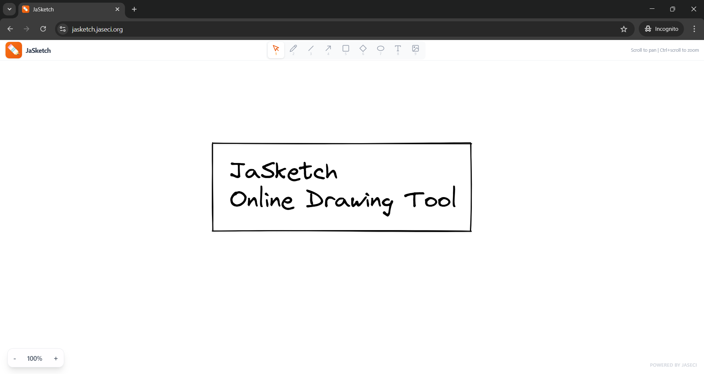

# JaSketch

A sketching and diagramming app built with [Jaclang](https://docs.jaseci.org/) and Canvas 2D.



## Features

- Freehand drawing, lines, arrows, rectangles, diamonds, ellipses, and text
- Image import (file picker + clipboard paste)
- Click-to-place lines/arrows with draggable bend points for curves
- Select, move, resize, group/ungroup elements
- Copy/paste, duplicate, undo/redo
- Export as PNG, SVG, or PDF
- Zoom and pan with scroll
- localStorage persistence

## Getting Started

```bash
python -m venv .venv
source .venv/bin/activate
pip install jaclang jac-client jac-scale
jac start
```

## Project Structure

```
jasketch/
├── main.jac                  # App entry point
├── styles.css                # Global styles (Tailwind)
├── components/
│   ├── Canvas.cl.jac         # Main canvas with drawing logic
│   ├── canvas/
│   │   ├── CanvasRenderer    # Canvas rendering layer
│   │   ├── ContextMenu       # Right-click context menu
│   │   └── TextInput         # Inline text editing
│   └── layout/
│       ├── TopBar            # Toolbar with tool selection
│       └── Sidebar           # Properties panel
├── hooks/                    # React hooks for state management
├── services/                 # Canvas rendering, collision, export, geometry
├── constants/                # Colors, fonts, tools, canvas defaults
└── assets/                   # Icon files
```

## MCP Server (AI Integration)

JaSketch includes an MCP (Model Context Protocol) server that lets AI assistants like Claude create and manipulate diagrams programmatically.

### Setup

```bash
claude mcp add --scope user jasketch -- uvx jasketch-mcp-server
```

That's it. The MCP server embeds its own WebSocket relay — no extra processes needed.

### Usage

1. Open JaSketch in a browser ([jasketch](https://jasketch.jaseci.org/))
2. Ask Claude to draw — e.g., "draw a flowchart showing user authentication"

### Available Tools

| Tool | Description |
|------|-------------|
| `create_element` | Create a single element (rectangle, circle, diamond, line, arrow, text, freehand) |
| `create_elements` | Batch create multiple elements efficiently |
| `query_elements` | Query elements on canvas, optionally filter by type or index |
| `update_element` | Update properties of an existing element by index |
| `delete_element` | Delete element(s) by index |
| `clear_canvas` | Clear all elements from the canvas |

### Configuration

**Claude Code** (CLI):

```bash
claude mcp add --scope user jasketch -- uvx jasketch-mcp-server
```

**Other assistants** (Cursor, Windsurf, Continue.dev, Zed, VS Code Copilot) require manual config. Add the following JSON to the config file for your assistant:

```json
{
  "mcpServers": {
    "jasketch": {
      "type": "stdio",
      "command": "uvx",
      "args": ["jasketch-mcp-server"]
    }
  }
}
```

| Assistant | Config file |
|-----------|-------------|
| Cursor | `~/.cursor/mcp.json` |
| Windsurf | `~/.codeium/windsurf/mcp_config.json` |
| Continue.dev | `~/.continue/config.json` (under `experimental.modelContextProtocolServers`) |
| Zed | `~/.config/zed/settings.json` (under `context_servers`) |
| VS Code Copilot | `.vscode/mcp.json` (project) or user `settings.json` (under `mcp`) |

| Variable | Default | Description |
|----------|---------|-------------|
| `JASKETCH_RELAY_PORT` | `9601` | WebSocket relay port (auto-started) |
| `JASKETCH_RELAY_URL` | `ws://localhost:9601` | Override to use an external relay |

## Tech

- **Jaclang** (.cl.jac) compiled to JavaScript
- **Canvas 2D** with viewport transformations
- **Tailwind CSS v4** for styling
- **Virgil** handwriting font (default)
